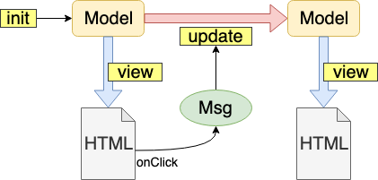

## Elmハンズオン

2019-07-26

---

## Elmってどんな言語？

- 純粋関数型
- JavaScript + HTML にコンパイルされる
- 言語内フレームワーク(The Elm Architecture)
- 実行時エラーが発生しない

---


## つまり？

安全で関数型が学べててげ楽しい！

---

## 時間割

- 準備＆座学 (20min)
- 課題1 (30min)
- 質問 ＆ 休憩 (10min)
- 課題2 (50min)
- 振り返り (10min)


---

## 感謝

場所の提供ありがとうございます！！！

---

## ソースコード

https://github.com/mather/elm-handson

- ローカルで試す方は `git clone` しましょう
- オンラインエディタで試す方はブラウザで開いてソースコードを随時コピーします

+++

## 準備(インストール)

- Homebrew : `brew install elm elm-format`
- npm : `npm i -g elm elm-format`
- インストーラー(Mac, Win)
    - https://guide.elm-lang.org/install.html
    - 僕は使ったことがない（汗
- 自分の好きなエディタでガシガシ試したい人はローカルへインストールしてください
- Atom + elmjutsu おすすめ

+++

## 準備(オンラインエディタを使う)

- 公式サイト : https://elm-lang.org/try
- Ellie **(推奨)** : https://ellie-app.com

+++

## ローカルで試す

```
$ cd ex1-countup/
$ elm reactor
Go to <http://localhost:8000> to see your project dashboard.
```

http://localhost:8000 へアクセスして `src` -> `countup.elm` を選択する

`elm reactor` がリクエストを受けて自動コンパイルするので、ブラウザをリロードすればOK

+++

## オンラインエディタで試す

`ex1-countup/src/countup.elm` の内容をコピーして貼り付ける

"compile" ボタンをクリックするとコンパイルしてくれる

Ellieの場合は "debug" ボタンを押すとデバッグウィンドウを出してくれる

---

## The Elm Architecture

アプリケーションのライフライクルの定義

- `init` : 初期状態
- `view` : ある状態をHTMLで表現する
- `update` : アクションに対応して状態を次の状態に変更する

+++

## ライフサイクルのイメージ



---

## elm repl

ローカルにインストールするとREPLが使える

```
$ elm repl
> :help
Valid commands include:

  :exit    Exit the REPL
  :help    Show this information
  :reset   Clear all previous imports and definitions

More info at <https://elm-lang.org/0.19.0/repl>
> 1 + 2
3 : number
> Just 3 |> Maybe.map (\x -> x + 1)
Just 4 : Maybe number
```

---

## Elm のドキュメント類

- 公式ドキュメント : https://elm-lang.org/docs
- パッケージ一覧 : https://package.elm-lang.org/

---

## 課題1

ボタンを押すとカウントアップするアプリケーション

フォルダ : `ex1-countup`

+++

## 課題1のデモ

+++

## main関数

The Elm Architecture に必要な関数をセットする

```elm
main =
    Browser.sandbox
        { init = init
        , update = update
        , view = view
        }
```

+++

## Model, init

```elm
-- Model : アプリケーションの状態を Model 型として定義する
type alias Model =
    { count: Int
    }

-- init : モデルの初期状態を与える
init : Model
init =
    { count = 0
    }
```

+++

## Msg, update

```elm
-- Msg : アプリケーション内で発生するアクションを定義
type Msg
    = Increment

-- update : アクション(Msg)が発生したときに、現在のモデルから新しいモデルを作る関数
update : Msg -> Model -> Model
update msg model =
    case msg of
        Increment ->
            { model | count = model.count + 1 }
```

+++

## view

```elm
view : Model -> Html Msg
view model =
    div []
        [ p [] [ text <| String.fromInt model.count ]
        , button [ onClick Increment ] [ text "+1" ]
        ]
```

---

## 課題1のミッション

- カウントをリセットする(0に戻す)ボタンを追加する

+++

## 「リセットする」アクションの追加

```elm
-- Msg : アプリケーション内で発生するアクションを定義
type Msg
    = Increment
    | Reset
```

+++

## コンパイルエラー

コンパイルエラーが丁寧すぎるくらい丁寧

```
-- MISSING PATTERNS ------------------------------------------------ countup.elm

This `case` does not have branches for all possibilities:

52|>    case msg of
53|>        Increment ->
54|>            model + 1

Missing possibilities include:

    Reset

I would have to crash if I saw one of those. Add branches for them!

Hint: If you want to write the code for each branch later, use `Debug.todo` as a
placeholder. Read <https://elm-lang.org/0.19.0/missing-patterns> for more
guidance on this workflow.
```

+++

## updateのパターンを追加する

```elm
update : Msg -> Model -> Model
update msg model =
    case msg of
        Increment ->
            model + 1

        Reset ->
            0
```

ひとまず動くけど、まだボタンがないのでリセットできない

+++

## リセットボタンの追加

```elm
view : Model -> Html Msg
view model =
    div []
        [ p [] [ text <| String.fromInt model ]
        , button [ onClick Increment ] [ text "+1" ]
        , button [ onClick Reset ] [ text "Reset" ]
        ]
```

リセットできるようになった

+++

# 完

- 追加ミッション(時間と気力に余裕がある人はぜひ自分で解いてみてね)
    - カウントを下げる(Decrement)ボタンを追加する
    - 0以下にカウントが下がらないようにする
    - `if` を使わない

---

## 質問 & 休憩

---

## 課題2

インクリメントサーチ

+++

## 課題2のデモ

---

## 課題2のソースコード

`ex2-incremental-search/src/search.elm`

- オフラインで試す人はディレクトリを移動して `elm reactor`
- オンラインエディタの人は内容をコピーして貼り付け

---

## 課題2のミッション

前方一致インクリメンタルサーチの実装

+++

## テキスト入力を状態に記録する

「文字列の入力」をアクションに定義

```elm
type Msg
    = NoOp
    | InputText String
```

+++

## エラーでますよね

```
-- MISSING PATTERNS --------------------------------------------- src/search.elm

This `case` does not have branches for all possibilities:

46|>    case msg of
47|>        NoOp ->
48|>            model

Missing possibilities include:

    InputText _

I would have to crash if I saw one of those. Add branches for them!

Hint: If you want to write the code for each branch later, use `Debug.todo` as a
placeholder. Read <https://elm-lang.org/0.19.0/missing-patterns> for more
guidance on this workflow.
```

+++

## updateに追加

```elm
update : Msg -> Model -> Model
update msg model =
    case msg of
        NoOp ->
            model

        InputText s ->
            { model | inputText = s }
```

エラーはでなくなったけど、何も変わらない…

+++

## テキストボックスとの連動

```elm
viewInput : Model -> Html Msg
viewInput model =
    div []
        [ input [ type_ "text", value model.inputText, onInput InputText ] []
        , text model.inputText
        ]
```

+++

## またエラー

`onInput` ってなんですか？と怒られる

```
-- NAMING ERROR ------------------------------------------------- src/search.elm

I cannot find a `onInput` variable:

70|         [ input [ type_ "text", value model.inputText, onInput InputText ] []
                                                           ^^^^^^^
These names seem close though:

    input
    viewInput
    Html.input
    asin

Hint: Read <https://elm-lang.org/0.19.0/imports> to see how `import`
declarations work in Elm.
```


+++

## import を書きましょう

```elm
import Browser
import Html exposing (Html, div, h1, input, li, text, ul)
import Html.Attributes exposing (type_, value)
import Html.Events exposing (onInput)  -- この行を追加
```

+++

## 確認 : 入力したものがコピーされて表示されていますか？

+++

## 検索を実装する

こちらの関数を追加

```elm
searchList : String -> List String
searchList word =
    List.filter (String.startsWith word) words
```

後ほど解説します

+++

## リストの表示部分に追加

```elm
viewList : String -> Html Msg
viewList word =
    ul [] <|
        List.map viewListItem (searchList word)
```

+++

## 怒られる

```
-- TYPE MISMATCH ------------------------------------------------ src/search.elm

The 3rd element of this list does not match all the previous elements:

67|         [ h1 [] [ text "Incremental Search" ]
68|         , viewInput model
69|>        , viewList
70|         ]

This `viewList` value is a:

    String -> Html Msg

But all the previous elements in the list are:

    Html Msg

Hint: Everything in the list needs to be the same type of value. This way you
never run into unexpected values partway through. To mix different types in a
single list, create a "union type" as described in:
<http://guide.elm-lang.org/types/union_types.html>
```

+++

## 修正する

```elm
view : Model -> Html Msg
view model =
    div []
        [ h1 [] [ text "Incremental Search" ]
        , viewInput model
        , viewList model.inputText
        ]
```

+++

# 完

動きましたか？

---

## 解説：シグネチャ

```elm
String.startsWith : String -> String -> Bool
```

- 第1引数 : 検索する文字列
- 第2引数 : 検索される文字列
- 返り値 : 見つかったら `True`

+++

## 解説：関数の部分適用

```
> search = String.startsWith "hoge"
<function> : String -> Bool
> search "fugahoge"
False : Bool
> search "hogefuga"
True : Bool
```

`search` は「部分適用された関数」となる

+++

## 検索の部分


```elm
List.filter : (a -> Bool) -> List a -> List a
```

`a` は「型引数」といって、同じ型であれば何でもいい

`String.startsWith word : String -> Bool` を部分適用すると…

```elm
List.filter (String.startsWith word) : List String -> List String

List.filter (String.startsWith word) words : List String
```

---

## Elmっぽい記法

カッコでごちゃついてる

```elm
viewList word =
    ul [] <|
        List.map viewListItem (searchList word)
```

+++

## Elmっぽい記法

スッキリさせる

```elm
viewList word =
    ul [] <|
        List.map viewListItem <|
            searchList word
```

+++

## Elmっぽい記法

これも

```elm
searchList : String -> List String
searchList word =
    List.filter (String.startsWith word) words
```

+++

## Elmっぽい記法

こう書ける

```elm
searchList : String -> List String
searchList word =
    let
        hasPrefix = String.startsWith word
    in
        List.filter hasPrefix words
```

---

## 課題2ができた人は

- 部分一致検索を実装してみましょう
    - ヒント : `startsWith` を変えます
- 前方一致と部分一致を切り替えられるようにしましょう(難易度高)
    - ヒント : 状態を追加しないといけません
- マッチしている部分を強調表示してみましょう

---

# まとめ

- 手軽に使えてすぐ確認できる
- 型、シグネチャの意識が身につく
    - 入出力をきっちり意識するようになる
- 怒られながら覚える

良いElmライフを！

+++

## 仲間募集してます

Discord の elm-jp コミュニティ

https://discord.gg/UDkqn3u